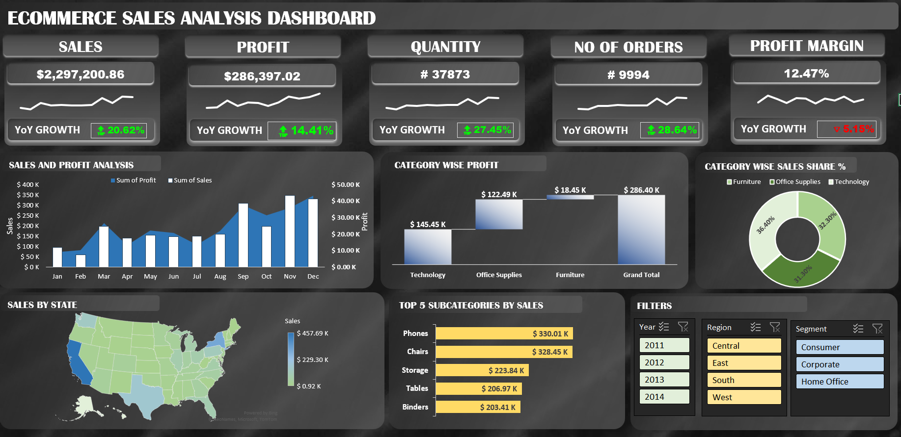
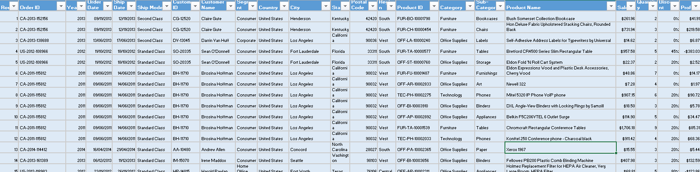
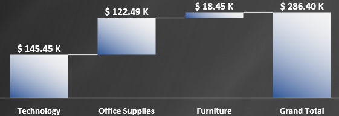
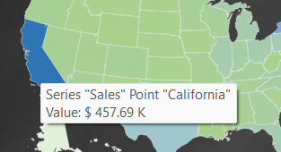

# Ecommerce Sales Analysis Dashboard

## Executive Summary
This project analyzes ecommerce sales data over the years 2011-2014, with the goal of providing key insights into sales performance, profitability, and areas for potential business growth. The analysis includes the creation of key performance indicators (KPIs), year-over-year (YoY) growth, and detailed visualizations such as sales vs. profit trends, category-wise analysis, and regional sales performance. The results offer valuable insights to help guide strategic decision-making.

## Objective
The objective of this project was to analyze ecommerce sales data and provide actionable insights into the business’s performance. By building KPIs, conducting YoY growth analysis, and visualizing data through charts, the aim was to identify trends, uncover opportunities, and help the business optimize its sales and profit strategies.

## Dataset Description

The dataset used for this analysis is a dummy ecommerce sales dataset that contains the following features:

Order ID, Customer ID, Product Details (Category, Subcategory, Product Name)
Sales Metrics (Sales, Quantity, Discount, Profit)
Location Data (Country, City, State, Region)
Temporal Data (Year, Order Date, Ship Date)
The data was cleaned and transformed into an Excel Table format, allowing for efficient use of Pivot Tables and charts for analysis.

## Methodology/Approach
Data Preparation: The raw data was converted into a Table format in Excel for easier manipulation and analysis.
KPIs Calculation: Key performance indicators such as total sales, profit, and profit margin were calculated for the years 2011-2014.
Year-over-Year (YoY) Growth: YoY growth for sales and profit was calculated to identify trends and compare year-over-year performance.
Data Visualization: Various charts and graphs were created to visualize sales vs. profit trends, category-wise profit, sales distribution by state, and top-performing subcategories.
Interactive Dashboard: Filters and slicers for years, regions, and segments were added to make the dashboard interactive and enable dynamic analysis.

## Findings
#### 1. Key Performance Indicators (KPIs):
1. Total Sales: $2M across the years 2011-2014.
2. Total Profit: $286K.
3. Profit Margin: 12.47%.
#### 2. Year-over-Year (YoY) Growth:
1. Growth trends show fluctuations in sales and profits year-over-year, with certain years demonstrating stronger growth than others.
#### 3. Category-wise Profit:
Some categories are significantly more profitable than others, indicating opportunities for focused marketing or resource allocation.

#### 4. Sales Share by Category:
A large proportion of sales come from specific categories, showing where the business should focus its efforts for future growth.
#### 5. Regional Insights:
Certain states or regions consistently outperform others in terms of sales and profit, highlighting key markets for further investment.

#### 6. Top 5 Subcategories by Sales:
These top subcategories generate the most sales and should be prioritized in future product offerings and inventory management.

## Business Insights/Recommendations
1. Profit Margin Optimization: The profit margin of 12.47% could be improved by analyzing low-performing categories or regions and focusing on improving operational efficiency or adjusting pricing strategies.

2. Focus on High-Performing Categories: Categories that are performing well should be the focus of marketing and sales efforts. Consider increasing the range of products within these categories.
   

4. Regional Sales Strategy: Invest more resources into high-performing regions and analyze the reasons for underperformance in other regions. Tailored marketing campaigns could help drive sales in these areas.
   

6. Subcategory Focus: The top-performing subcategories by sales should be closely monitored and prioritized for future product development and stock management. These subcategories can also be a focus for targeted promotions.

